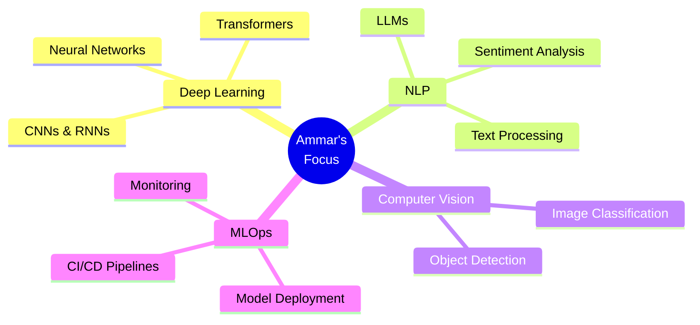

<div align="center">


</div>

<div align="center">

[](https://git.io/typing-svg)

<br/>

[](https://github.com/loplop05)
[](https://github.com/loplop05?tab=followers)
[](https://github.com/loplop05)

</div>

---


###  About Me

```python
class Ammar:
    def __init__(self):
        self.name = "Ammar Al-Haroun"
        self.role = "AI & Data Science Engineer"
        self.location = "Amman, Jordan 🇯🇴"
        self.education = "AI & Data Science Student"
        self.languages = ["Arabic (Native)", "English (Fluent)"]
        
    @property
    def skills(self):
        return {
            "ai_ml": [
                "Deep Learning", "Neural Networks",
                "Natural Language Processing", 
                "Computer Vision", "Transformers"
            ],
            "data_science": [
                "Data Analysis", "Data Visualization",
                "Feature Engineering", "Statistical Modeling",
                "Predictive Analytics"
            ],
            "programming": [
                "Python", "C# .NET", "C++", 
                "Java", "JavaScript"
            ],
            "frameworks": [
                "PyTorch", "TensorFlow", "Scikit-learn",
                "Pandas", "NumPy", "Keras"
            ],
            "databases": ["SQL Server", "MySQL", "PostgreSQL"],
            "tools": ["Git", "Jupyter", "Docker", "VS Code"]
        }
    
    @property
    def currently_working_on(self):
        return [
            "🎓 Neural Networks & Deep Learning ",
            "🔬 Exploring Large Language Models & Transformers",
            "🛠️ Building scalable ML pipelines",
            
        ]
    
  

# Initialize
ammar = Ammar()
print(f"Hello, World! I'm {ammar.name} 👋")
```

<br clear="right"/>

---

<div align="center">

## 🎯 Core Competencies

<table>
<tr>
<td align="center" width="25%">

<br><strong>Artificial Intelligence</strong>
<br><sub>Neural Networks, Deep Learning</sub>
</td>
<td align="center" width="25%">

<br><strong>Python Development</strong>
<br><sub>Data Science, ML Engineering</sub>
</td>
<td align="center" width="25%">

<br><strong>.NET Development</strong>
<br><sub>Backend, API Development</sub>
</td>
<td align="center" width="25%">

<br><strong>Database Management</strong>
<br><sub>SQL Server, MySQL</sub>
</td>
</tr>
</table>

</div>

---

## 🧠 AI / Machine Learning Arsenal

<div align="center">

### Core ML & Deep Learning


### Data Science & Analytics


</div>

---

## 💻 Development Stack

<div align="center">

### Programming Languages


### Databases & Tools


</div>

---

##  Featured Projects

<div align="center">


</div>

<br/>

<div align="center">

###  Current Focus Areas



</div>

---


<br/>

<div align="center">


---

## 🏆 GitHub Trophies

<div align="center">

[](https://github.com/ryo-ma/github-profile-trophy)

</div>

---

##  Contribution Activity

<div align="center">

[](https://github.com/ashutosh00710/github-readme-activity-graph)

</div>

---

##  Highlights & Achievements

<div align="center">

|  Focus Area |  Learning Path |  Building |
|:---:|:---:|:---:|
| Deep Learning & Neural Networks | Advanced PyTorch & TensorFlow |
| Natural Language Processing | Transformer Architecture | Text Classification Models |
| Computer Vision | CNN & Object Detection | Image Recognition Apps |
| MLOps & Deployment | Docker & CI/CD | Scalable ML Pipelines |

</div>

---

##  Latest Blog Posts & Articles

<div align="center">

<!-- BLOG-POST-LIST:START -->
-  Understanding Neural Networks from Scratch
-  Building Your First NLP Model with PyTorch
-  Data Preprocessing Techniques for ML
-  Optimizing Deep Learning Models
<!-- BLOG-POST-LIST:END -->

</div>

---

##  Education & Certifications

<div align="center">

```yaml
Education:
  Degree: AI & Data Science Engineering
  Institution: University (In Progress)
  Focus: Deep Learning, Machine Learning, Data Analytics

Current Courses:
  - Neural Networks & Deep Learning 
  - Advanced Machine Learning Techniques
  - Natural Language Processing

Certifications:
  - Deep Learning Specialization (In Progress)
  - Machine Learning Engineering
  - Python for Data Science
```

</div>

---

##  Let's Connect!

<div align="center">

###  Find me around the web

<br/>

[](https://linkedin.com/in/your-profile)
[](mailto:your@email.com)
[](https://github.com/loplop05)
[](https://twitter.com/your-handle)
[](https://stackoverflow.com/users/your-id)
[](https://kaggle.com/your-profile)

<br/>

### 📫 How to reach me

💼 **Professional:** [Ammaralharoon@hotmail.com](mailto:your-email@domain.com)  
  
💬 **Open to:** Collaborations, ML Projects, Research Opportunities

</div>

---

<div align="center">


</div>

---


---

<div align="center">


<br/>

---

<sub> From [loplop05](https://github.com/loplop05) | </sub>

<br/>


</div>
